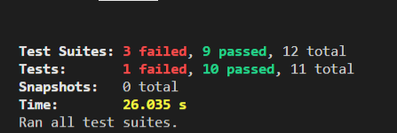

Fallos actuales:

```
src/app/principal/navbar/navbar.component.spec.ts

● Test suite failed to run.component.spec.ts

Cannot find module 'src/app/services/autenticacion.service' from 'src/app/principal/navbar/navbar.component.ts'

Require stack:
src/app/principal/navbar/navbar.component.ts
src/app/principal/navbar/navbar.component.spec.ts
```

```
src/app/principal/login/login.component.spec.ts

● Test suite failed to run.component.spec.ts

Cannot find module 'src/app/services/autenticacion.service' from 'src/app/principal/login/login.component.spec.ts'
```

```
src/app/principal/home/home.component.spec.ts (13.904 s)
● HomeComponent › should have a var named title

Unexpected value 'ActivatedRoute' imported by the module 'DynamicTestModule'. Please add an @NgModule annotation.
```

- tsconfig.spec - copia .....usa jasmine asi que no cuenta
- tsconfig.app - copia .....tampoco cuenta
