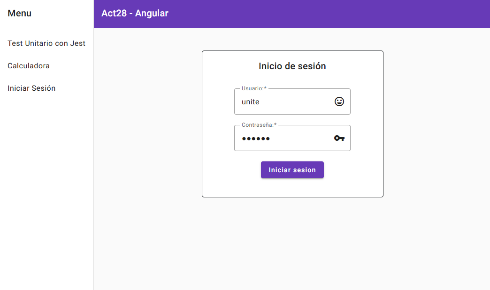

# Tarea28

Demo: <https://araceliponce.github.io/tarea28/>

## Integrantes:

- ARACELI PONCE SANGA
- EDILT LUZ TORIBIO FLORES
- MARWIN WLADIMIR GARAY MONTOYA
- JHYM STONY HUALLA MUÑOZ

---

- La aplicación cuenta con una vista de Inicio de sesión. Cuenta con validaciones de tipo 'required' y acepta solo los pares de datos de acceso correctos (usuario: unite y contraseña: 123456)

- Su segunda vista es una calculadora simple que ejecuta la operación que le indiques. Te envía una alerta si no has seleccionado ninguna operación

